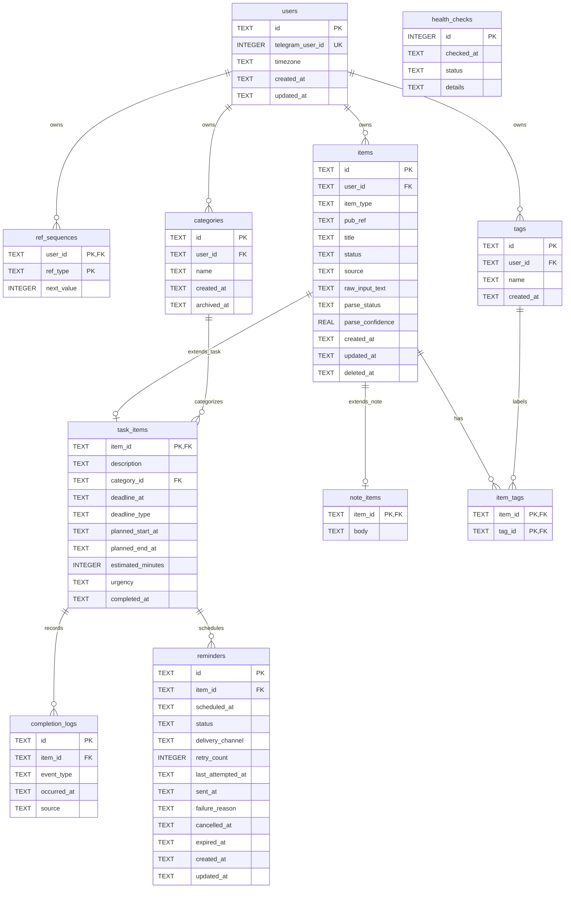

# TeleSecretary Database Diagram

## Relationship Notes

- `items` is the shared parent table for both tasks and notes.
- `task_items.item_id` must reference an `items` row with `item_type = 'task'`.
- `note_items.item_id` must reference an `items` row with `item_type = 'note'`.
- `items.item_type` cannot be changed after creation.
- `categories` are optional for tasks. Deleting a category sets
  `task_items.category_id` to `NULL`.
- `item_tags` is the many-to-many join table between `items` and `tags`.
- `completion_logs` only attach to task rows through `task_items`.
- `reminders` are separate scheduled notification lifecycles. They reference
  `task_items` directly, so only tasks can receive reminders.
- `items.pub_ref` gives every item a stable, human-friendly reference while
  `items.id` remains the internal UUID-backed identity. Tasks use refs such as
  `T12`; notes use refs such as `N4`.
- `ref_sequences` stores the next reference number per user and item type.
  Future item types can add a prefix without adding another reference table.
- `health_checks` is operational state and is not tied to a user.

## Important Constraints

- `users.telegram_user_id` is unique.
- `tags` are unique per user by `(user_id, name)`.
- Active category names are unique per user while `archived_at IS NULL`.
- `items.item_type` is either `task` or `note`.
- `items.status` is one of `active`, `completed`, `archived`, or `deleted`.
- Deleted items must have `deleted_at`; non-deleted items must not.
- `task_items.deadline_type` is `hard`, `soft`, or `NULL`.
- `task_items.urgency` is `low`, `medium`, `high`, `top_priority`, or `NULL`.
- `completion_logs.event_type` is either `completed` or `reopened`.
- `items.pub_ref` is required for new items and cannot change after creation.
- `(items.user_id, items.pub_ref)` is unique, so separate users may each have
  `T1`, while one user cannot have two items with the same public ref.
- Task refs use canonical `T[1-9][0-9]*` values; note refs use canonical
  `N[1-9][0-9]*` values. Leading zeroes are not valid.
- `reminders.status` is `pending`, `processing`, `sent`, `failed`, `cancelled`,
  or `expired`; terminal timestamps must match the terminal state.
- Only Telegram delivery is supported in V1. Retry counts cannot be negative.
- Pending and processing reminders are unique by task, scheduled time, and
  delivery channel. Terminal reminders remain as history and do not block a
  replacement.

## Migration Notes

- `0001_foundation.sql` creates users, reference sequences, and health checks.
- `0002_phase1_items.sql` creates the shared item model and task/note tables.
- `0003_task_refs.sql` creates `task_refs`, assigns refs to existing tasks in a
  stable creation order, and advances each user's task-reference sequence.
- `0004_subtype_public_references.sql` moves existing task refs into
  `items.pub_ref`, assigns refs to existing notes, advances note sequences,
  enforces stable owner-scoped refs, and removes the transitional `task_refs`
  table.
- `0005_reminders.sql` creates task-linked reminder lifecycles, their
  persistence constraints, due-polling and task/status indexes, and active
  duplicate prevention.

## Data Dictionary

This section describes the semantic meaning of every persisted field. `NULL`
means the information is optional or has not occurred yet. Unless noted
otherwise, application timestamps are stored as UTC ISO 8601 text.

### `users`

One row represents one TeleSecretary user and owns that user's items,
vocabulary, and public-reference sequences.

| Column | Semantic meaning |
| --- | --- |
| `id` | Stable internal user identifier referenced by all user-owned records. This is not shown to the user. |
| `telegram_user_id` | Telegram's numeric identifier for the person. It connects an incoming Telegram account to this internal user and is unique when present. |
| `timezone` | IANA timezone used to interpret user-entered dates and times and to localize stored UTC timestamps for display, for example `America/Chicago`. |
| `created_at` | When the user row was first created. Foundation rows use SQLite's UTC `CURRENT_TIMESTAMP`. |
| `updated_at` | When the user row was most recently updated. |

### `ref_sequences`

Tracks the next public-reference number independently for each user and item
type. It allocates readable refs without exposing internal UUIDs.

| Column | Semantic meaning |
| --- | --- |
| `user_id` | User who owns this sequence. Forms the composite primary key with `ref_type`. |
| `ref_type` | Logical item type whose numbers are being allocated, currently `task` or `note`. |
| `next_value` | Positive integer that will be used for the next ref of this type. For example, `task` plus `12` produces `T12`, after which this becomes `13`. |

### `health_checks`

Stores operational health-check results. These rows describe the application,
not a particular user.

| Column | Semantic meaning |
| --- | --- |
| `id` | Auto-incrementing identifier for one health-check execution. |
| `checked_at` | UTC time when the health check ran. |
| `status` | Outcome reported by the health check, such as `ok`. |
| `details` | Optional diagnostic context associated with the result. It is `NULL` when no extra explanation is needed. |

### `items`

Shared parent row for every first-class item. It contains identity, ownership,
common lifecycle state, capture provenance, and parsing metadata. Type-specific
content lives in the matching subtype table.

| Column | Semantic meaning |
| --- | --- |
| `id` | Stable internal item identifier, currently a UUID string. Foreign keys use this value; users interact with `pub_ref` instead. |
| `user_id` | User who owns the item and controls access to it. |
| `item_type` | Immutable subtype discriminator. `task` requires a `task_items` row and `note` requires a `note_items` row. |
| `pub_ref` | Stable, owner-scoped public identifier used in user-facing interactions. Tasks use `T<number>` and notes use `N<number>`. It cannot change after creation. |
| `title` | Short primary label used to identify the item in lists and responses. It cannot be blank. |
| `status` | Current lifecycle state: `active`, `completed`, `archived`, or `deleted`. |
| `source` | Channel or workflow that most recently created or changed the item, such as `telegram_command`, `telegram_nl`, or `manual_entry`. |
| `raw_input_text` | Optional unmodified user input retained for debugging, auditing, or future reprocessing. |
| `parse_status` | Result of interpreting the input: `not_applicable`, `parsed`, `fallback`, `needs_clarification`, or `failed`. |
| `parse_confidence` | Optional parser confidence from `0.0` to `1.0`. It is `NULL` when no confidence score applies. |
| `created_at` | UTC time when the item was created. |
| `updated_at` | UTC time when the item's current state was most recently changed. |
| `deleted_at` | UTC soft-deletion time. It is required when `status = 'deleted'` and otherwise must be `NULL`. |

### `categories`

User-managed, single-value grouping vocabulary for tasks, such as `work` or
`school`.

| Column | Semantic meaning |
| --- | --- |
| `id` | Stable internal category identifier. |
| `user_id` | User who owns and may use the category. |
| `name` | User-facing category label. Active names are unique within the owning user. |
| `created_at` | UTC time when the category was created. |
| `archived_at` | UTC time when the category was retired. `NULL` means it is active and available for assignment. |

### `tags`

User-managed, many-to-many labels that can be attached to items.

| Column | Semantic meaning |
| --- | --- |
| `id` | Stable internal tag identifier. |
| `user_id` | User who owns and may use the tag. |
| `name` | User-facing tag label, unique within the owning user. |
| `created_at` | UTC time when the tag was created. |

### `task_items`

Task-only extension of an `items` row. All fields other than `item_id` are
optional so a title-only task remains valid.

| Column | Semantic meaning |
| --- | --- |
| `item_id` | Internal ID of the parent `items` row. It is also this table's primary key, so each task has at most one task extension. |
| `description` | Optional longer explanation, context, or acceptance detail for the task. |
| `category_id` | Optional category assigned to the task. If that category is deleted, this becomes `NULL`. |
| `deadline_at` | Optional UTC instant by which the task is due. This is distinct from a reminder or planned work time. |
| `deadline_type` | Meaning of the deadline: `hard` for a consequential cutoff or `soft` for a target date. It must be `NULL` when no deadline exists. |
| `planned_start_at` | Optional UTC start of the period when the user intends to work on the task. |
| `planned_end_at` | Optional UTC end of the intended work period. It cannot precede `planned_start_at` when both are present. |
| `estimated_minutes` | Optional positive estimate of how many minutes the task will take. |
| `urgency` | Optional user-facing urgency level: `low`, `medium`, `high`, or `top_priority`. |
| `completed_at` | UTC time of the task's current/latest completion. It returns to `NULL` when the task is reopened; history remains in `completion_logs`. |

### `reminders`

Separate notification lifecycles scheduled for tasks. Reminder ownership is
inherited through its task; it is not duplicated on the reminder row.

| Column | Semantic meaning |
| --- | --- |
| `id` | Stable internal UUID-backed identifier for one reminder lifecycle. It is not user-facing. |
| `item_id` | Internal ID of the task receiving the reminder. It references `task_items.item_id`, so notes cannot receive reminders. |
| `scheduled_at` | UTC instant when the reminder first becomes due. |
| `status` | Lifecycle state: `pending`, `processing`, `sent`, `failed`, `cancelled`, or `expired`. |
| `delivery_channel` | Delivery adapter selected for the reminder. V1 supports `telegram` only. |
| `retry_count` | Non-negative count of delivery attempts already made. |
| `last_attempted_at` | UTC time of the latest delivery attempt; `NULL` before any attempt. |
| `sent_at` | UTC successful-delivery time. It is present exactly when `status` is `sent`. |
| `failure_reason` | Latest sanitized delivery failure detail. It is required for terminal `failed` reminders. |
| `cancelled_at` | UTC cancellation time. It is present exactly when `status` is `cancelled`. |
| `expired_at` | UTC time when the reminder was deemed too stale to send. It is present exactly when `status` is `expired`. |
| `created_at` | UTC time when the reminder lifecycle was created. |
| `updated_at` | UTC time when the reminder row was most recently changed. |

### `note_items`

Note-only extension of an `items` row for informational or non-actionable
content.

| Column | Semantic meaning |
| --- | --- |
| `item_id` | Internal ID of the parent `items` row. It is also this table's primary key, so each note has at most one note extension. |
| `body` | Optional full note content beyond the shared title. |

### `item_tags`

Join table implementing the many-to-many relationship between items and tags.
One row means one tag is attached to one item.

| Column | Semantic meaning |
| --- | --- |
| `item_id` | Internal ID of the item being labeled. Forms the composite primary key with `tag_id`. |
| `tag_id` | Internal ID of the tag attached to the item. Forms the composite primary key with `item_id`. |

### `completion_logs`

Append-only history of task completion transitions. This preserves past events
separately from the current snapshot in `items.status` and
`task_items.completed_at`.

| Column | Semantic meaning |
| --- | --- |
| `id` | Stable internal identifier for one completion-history event. |
| `item_id` | Task that changed state. It references the task's `task_items` row, so note items cannot have completion events. |
| `event_type` | Transition that occurred: `completed` or `reopened`. |
| `occurred_at` | UTC time when the transition occurred. |
| `source` | Channel or workflow that caused the transition, using the same controlled values as `items.source`. |
