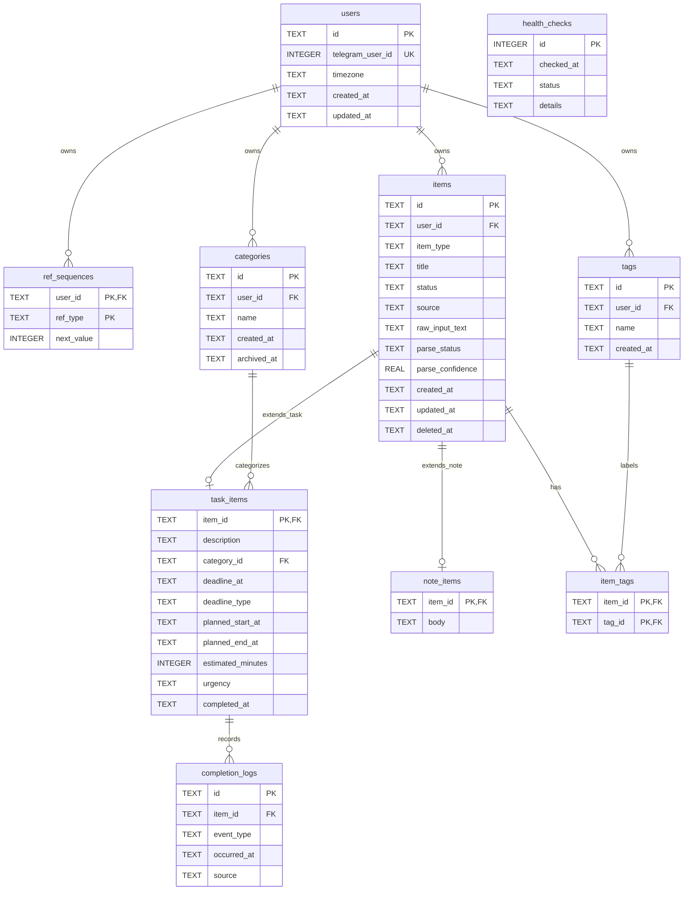

# TeleSecretary Database Diagram

## Relationship Notes

- `items` is the shared parent table for both tasks and notes.
- `task_items.item_id` must reference an `items` row with `item_type = 'task'`.
- `note_items.item_id` must reference an `items` row with `item_type = 'note'`.
- `items.item_type` cannot be changed after creation.
- `categories` are optional for tasks. Deleting a category sets
  `task_items.category_id` to `NULL`.
- `item_tags` is the many-to-many join table between `items` and `tags`.
- `completion_logs` only attach to task rows through `task_items`.
- `health_checks` is operational state and is not tied to a user.

## Important Constraints

- `users.telegram_user_id` is unique.
- `tags` are unique per user by `(user_id, name)`.
- Active category names are unique per user while `archived_at IS NULL`.
- `items.item_type` is either `task` or `note`.
- `items.status` is one of `active`, `completed`, `archived`, or `deleted`.
- Deleted items must have `deleted_at`; non-deleted items must not.
- `task_items.deadline_type` is `hard`, `soft`, or `NULL`.
- `task_items.urgency` is `low`, `medium`, `high`, `top_priority`, or `NULL`.
- `completion_logs.event_type` is either `completed` or `reopened`.
